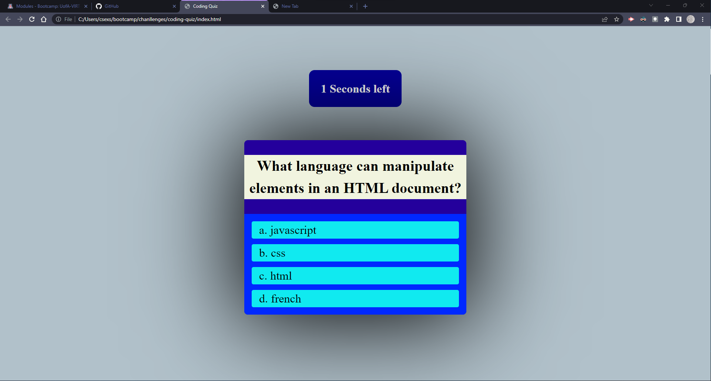
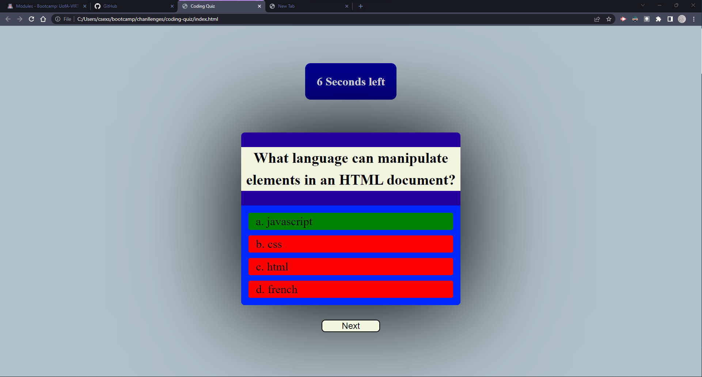

# coding-quiz

## User Story

```
AS A coding boot camp student
I WANT to create a timed quiz on JavaScript fundamentals that stores high scores
SO THAT I can gauge my progress compared to my peers
```

## Acceptance Criteria

```
GIVEN a user taking a code quiz
WHEN the user click the start button
THEN a timer starts and the user is presented with a question
WHEN the user answer a question
THEN the user is presented with another question
WHEN the user questions incorrectly
THEN time is subtracted from the clock
WHEN all questions are answered or the timer reaches 0
THEN the game is over
WHEN the game is over
THEN the user can save thier initials and score
```

## Mock-Up





